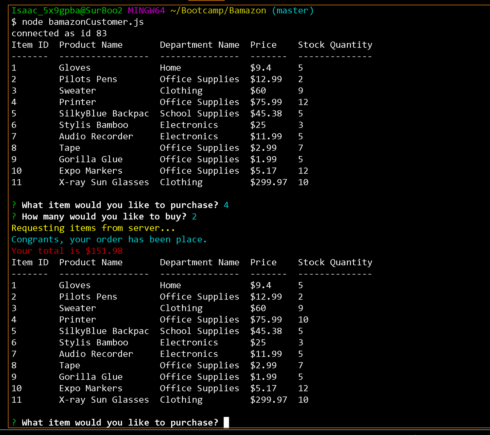
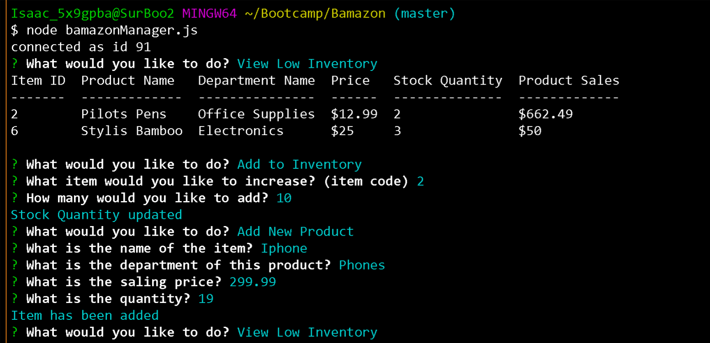

# Bamazon
## Introduction
We created this project to practice *Node Js* and reading/writing to a sql database. We wrote sql queries to update inventory and add products. There are costomer view, Manager view, and Supervisor view. Each of this views have different access levels. For instants a supervisor may add departments and categories while customer cannot. 

## Screen Shots
### Customer.js

 Purchasing an item and updating database

 
### Manager.js
Viewing products for sale. 

 
Viewing product with stock less than 5.

 
Increading inventroy.

 
### Supervisor.js
Viewing inventory by departments and calculating profit on the fly. 

 
Creating new department. 

 
